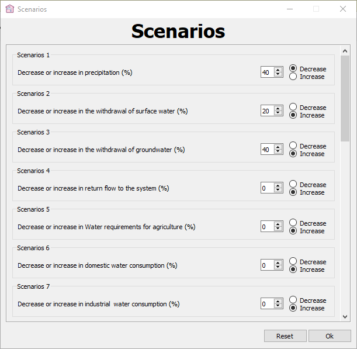

# Aquametrics Plus: Advanced Automation for Water Accounting Plus (WA+)

**Aquametrics Plus (v1.0)** is a specialized hydro-informatics software designed to automate, standardize, and enhance the accuracy of the FAO Water Accounting Plus (WA+) framework. It bridges the gap between complex remote sensing data and actionable water management insights, eliminating the need for manual calculations or external GIS software.

> ⚠️ **Note on Source Code:**
> This software is the core output of an ongoing Master's thesis at the **University of Tehran**. Due to intellectual property regulations and pending peer-reviewed publications, the **source code is currently protected (Placeholder Mode)**.
> However, the compiled executable is available for research and demonstration purposes in the [Releases](../../releases) section.

---

## 🎯 Problem Statement & Solution

Traditional implementation of the WA+ framework is fraught with challenges:
* **Complexity:** Requires advanced scripting skills to access satellite data (WaPOR).
* **Dependency:** Heavy reliance on external, expensive software like ArcGIS.
* **Human Error:** Manual spreadsheet calculations often lead to mass balance errors.

**Aquametrics Plus** solves these by providing a standalone, automated engine that handles the entire pipeline: from fetching satellite imagery to generating final authorized reports.

## 🚀 Key Innovations

### 1. Automated WaPOR Data Acquisition
The software connects directly to the **FAO WaPOR API**. Users no longer need python scripts to download raster data. The built-in ETL (Extract, Transform, Load) engine automatically fetches, clips, and processes satellite imagery (Evaporation, Transpiration, Precipitation, etc.) based on the basin boundary.

  
   
  <em>Figure 1: Integrated WaPOR Downloader with token authentication and spatial filtering.</em>

### 2. Intelligent 3-Level Validation System
To ensure 0% calculation error, the software implements a rigid validation protocol:
1.  **Input Check:** Validates data types and formats instantly.
2.  **Logical Check:** Detects anomalies (e.g., negative values in physical parameters) and guides the user to the exact error location.
3.  **Mass Balance Check:** Ensures the "Closure Fraction" meets the required precision before generating reports.

  
   
  <em>Figure 2: The intelligent error-handling system preventing invalid data entry and ensuring mass balance conservation.</em>

### 3. GIS-Independent Processing
Unlike previous methods, Aquametrics Plus has an **internal GIS engine**. It handles raster processing, shapefile management, and spatial calculations (zonal statistics) without requiring ArcGIS or QGIS.

  
   
  <em>Figure 3: Main Dashboard featuring the layer manager and internal map viewer.</em>

### 4. Rapid Scenario Analysis
The software includes a "Scenario Manager" capable of simulating **21 different management strategies** (e.g., climate change impact, irrigation efficiency changes).
* **Old Method:** Days of recalculation.
* **Aquametrics Plus:** Results in < 60 seconds.

| Scenario Manager | Automated Reporting (WA+ Sheet 1) |
|:---:|:---:|
|  |  |
| *Defining management scenarios* | *Auto-generated Resource Base Sheet* |

---

## 🛠️ Technical Architecture

* **Core Engine:** Python 3.9
* **GUI Framework:** PyQt5 (Responsive Design)
* **Data Processing:** NumPy, Pandas, Rasterio
* **Visualization:** Matplotlib integration for real-time plotting
* **Database:** Internal structured file system for project management

## 🔗 Citation

This software is developed and validated as part of the following research. If you use Aquametrics Plus, please cite:

> **Nemati Mansour, A.**, Javadi, S., Kardan Moghadam, H., Ostad-Ali-Askari, K., & Ramesh, A. (Under Review). *Introducing Aquametrics Plus - Water Accounting Plus (WA+) Software with a Balance Calculation Approach: A Case Study in the Upstream Side of Zayandehrood Dam*. Submitted to Innovative Infrastructure Solutions.

## 👨‍💻 Developer & Contact

**Amirreza Nemati Mansour**
* *M.Sc. in Water Engineering, University of Tehran*
* 📧 Email: [amirreza.nemati@ut.ac.ir](mailto:amirreza.nemati@ut.ac.ir)
* 🔗 [GitHub Profile](https://github.com/AmirrezaNemati)

**Supervisors:**
* Dr. Saman Javadi (University of Tehran)
* Dr. Hamid Kardan Moghadam (Water Research Institute)

---
**Copyright © 2025 Amirreza Nemati Mansour. All Rights Reserved.**
*Unauthorized reproduction or reverse engineering of the binary executable is strictly prohibited.*
